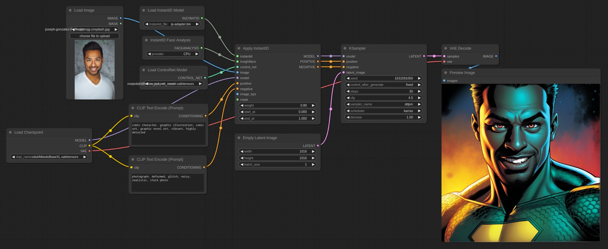

# ComfyUI InstantID (Native Support)

Native [InstantID](https://github.com/InstantID/InstantID) support for [ComfyUI](https://github.com/comfyanonymous/ComfyUI).

This extension differs from the many already available as it doesn't use *diffusers* but instead implements InstantID natively and it fully integrates with ComfyUI.

# Sponsorship

**[:heart: Github Sponsor](https://github.com/sponsors/cubiq) | [:coin: Paypal](https://paypal.me/matt3o)**

If you like my work and wish to see updates and new features please consider sponsoring my projects.

- [ComfyUI IPAdapter Plus](https://github.com/cubiq/ComfyUI_IPAdapter_plus)
- [ComfyUI InstantID (Native)](https://github.com/cubiq/ComfyUI_InstantID)
- [ComfyUI Essentials](https://github.com/cubiq/ComfyUI_essentials)
- [ComfyUI FaceAnalysis](https://github.com/cubiq/ComfyUI_FaceAnalysis)
- [Comfy Dungeon](https://github.com/cubiq/Comfy_Dungeon)

Not to mention the documentation and videos tutorials. Check my **ComfyUI Advanced Understanding** videos on YouTube for example, [part 1](https://www.youtube.com/watch?v=_C7kR2TFIX0) and [part 2](https://www.youtube.com/watch?v=ijqXnW_9gzc)

The only way to keep the code open and free is by sponsoring its development. The more sponsorships the more time I can dedicate to my open source projects.

Please consider a [Github Sponsorship](https://github.com/sponsors/cubiq) or [PayPal donation](https://paypal.me/matt3o) (Matteo "matt3o" Spinelli). For sponsorships of $50+, let me know if you'd like to be mentioned in this readme file, you can find me on [Discord](https://latent.vision/discord) or _matt3o :snail: gmail.com_.

## Important updates

- **2024/02/27:** Added [noise injection](#noise-injection) in the negative embeds.

- **2024/02/26:** Fixed a small but nasty bug. Results will be different and you may need to lower the CFG.

- **2024/02/20:** I refactored the nodes so they are hopefully easier to use. **This is a breaking update**, the previous workflows won't work anymore.

## Basic Workflow

In the `examples` directory you'll find some basic workflows.

## Video Tutorial

** :movie_camera: [Introduction to InstantID features](https://youtu.be/wMLiGhogOPE)**

## Installation

**Upgrade ComfyUI to the latest version!**

Download or `git clone` this repository into the `ComfyUI/custom_nodes/` directory or use the Manager.

InstantID requires `insightface`, you need to add it to your libraries together with `onnxruntime` and `onnxruntime-gpu`.

The InsightFace model is **antelopev2** (not the classic buffalo_l). Download the models (for example from [here](https://drive.google.com/file/d/18wEUfMNohBJ4K3Ly5wpTejPfDzp-8fI8/view?usp=sharing) or [here](https://huggingface.co/MonsterMMORPG/tools/tree/main)), unzip and place them in the `ComfyUI/models/insightface/models/antelopev2` directory.

The **main model** can be downloaded from [HuggingFace](https://huggingface.co/InstantX/InstantID/resolve/main/ip-adapter.bin?download=true) and should be placed into the `ComfyUI/models/instantid` directory. (Note that the model is called *ip_adapter* as it is based on the [IPAdapter](https://github.com/tencent-ailab/IP-Adapter)).

You also needs a [controlnet](https://huggingface.co/InstantX/InstantID/resolve/main/ControlNetModel/diffusion_pytorch_model.safetensors?download=true), place it in the ComfyUI controlnet directory.

**Remember at the moment this is only for SDXL.**

## Watermarks!

The training data is full of watermarks, to avoid them to show up in your generations use a resolution slightly different from 1024×1024 (or the standard ones) for example **1016×1016** works pretty well.

## Lower the CFG!

It's important to lower the CFG to at least 4/5 or you can use the `RescaleCFG` node.

## Face keypoints

The person is posed based on the keypoints generated from the reference image. You can use a different pose by sending an image to the `image_kps` input.

## Noise Injection

The default InstantID implementation seems to really burn the image, I find that by injecting noise to the negative embeds we can mitigate the effect and also increase the likeliness to the reference. The default Apply InstantID node automatically injects 35% noise, if you want to fine tune the effect you can use the Advanced InstantID node.

This is still experimental and may change in the future.

## Additional Controlnets

You can add more controlnets to the generation. An example workflow for depth controlnet is provided.

## Styling with IPAdapter

It's possible to style the composition with IPAdapter. An example is provided.

## Multi-ID

Multi-ID is supported but the workflow is a bit complicated and the generation slower. I'll check if I can find a better way of doing it. The "hackish" workflow is provided in the example directory.

## Advanced Node

There's an InstantID advanced node available, at the moment the only difference with the standard one is that you can set the weights for the instantID models and the controlnet separately. It now also includes a noise injection option. It might be helpful for finetuning.

The instantID model influences the composition of about 25%, the rest is the controlnet.

The noise helps reducing the "burn" effect.

## Other notes

It works very well with SDXL Turbo/Lighting. Best results with community's checkpoints.

## Current sponsors

It's only thanks to generous sponsors that **the whole community** can enjoy open and free software. Please join me in thanking the following companies and individuals!

### Gold sponsors

&nbsp; &nbsp;

### Companies supporting my projects

- [RunComfy](https://www.runcomfy.com/) (ComfyUI Cloud)

### Esteemed individuals

- [Jack Gane](https://github.com/ganeJackS)
- [Nathan Shipley](https://www.nathanshipley.com/)

### One-time Extraordinaire

- [Eric Rollei](https://github.com/EricRollei)
- [francaleu](https://github.com/francaleu)
- [Neta.art](https://github.com/talesofai)
- [Samwise Wang](https://github.com/tzwm)
- _And all private sponsors, you know who you are!_