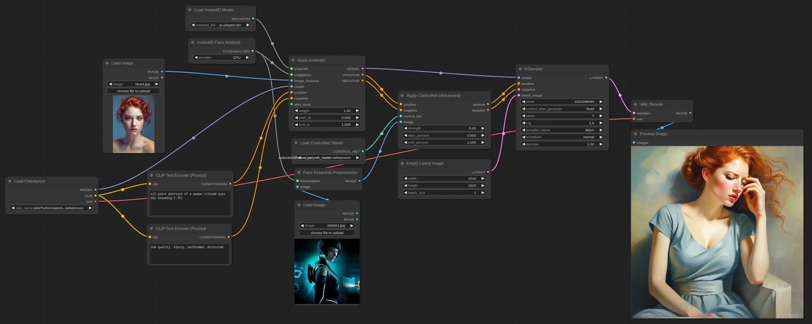

# ComfyUI InstantID (Native Support)

Native [InstantID](https://github.com/InstantID/InstantID) support for [ComfyUI](https://github.com/comfyanonymous/ComfyUI).

This extension differs from the many already available as it doesn't use *diffusers* but instead implements InstantID natively and it fully integrates with ComfyUI.

Please note this still could be considered beta stage, looking forward to your feedback.

## Basic Workflow

In the `examples` directory you'll find some basic workflows.

## Installation

**Upgrade ComfyUI to the latest version!** ComfyUI required a small update to work with InstantID that was pushed recently.

Download or `git clone` this repository into the `ComfyUI/custom_nodes/` directory. I guess the Manager will soon have this added to the list.

InstantID requires `insightface`, you need to add it to your libraries together with `onnxruntime` and `onnxruntime-gpu`.

The InsightFace model is **antelopev2** (not the classic buffalo_l). Download the models (for example from [here](https://drive.google.com/file/d/18wEUfMNohBJ4K3Ly5wpTejPfDzp-8fI8/view?usp=sharing) or [here](https://huggingface.co/MonsterMMORPG/tools/tree/main)) and place them in the `ComfyUI/models/insightface/models/antelopev2` directory.

The **main model** can be downloaded from [HuggingFace](https://huggingface.co/InstantX/InstantID/resolve/main/ip-adapter.bin?download=true) and should be placed into the `ComfyUI/models/instantid` directory. (Note that the model is called *ip_adapter* as it is based on the [IPAdapter](https://github.com/tencent-ailab/IP-Adapter) models).

You also needs a [controlnet](https://huggingface.co/InstantX/InstantID/resolve/main/ControlNetModel/diffusion_pytorch_model.safetensors?download=true), place it in the ComfyUI controlnet directory.

**Remember at the moment this is only for SDXL.**

## Watermarks!

The training data is full of watermarks, to avoid them to show up in your generations use a resolution slightly different from 1024×1024 for example **1016×1016** works pretty well.

## Lower the CFG!

It's important to lower the CFG to at least 4/5 or you can use the `RescaleCFG` node.

## Other notes

It works very well with SDXL Turbo. Best results with community's checkpoints.

