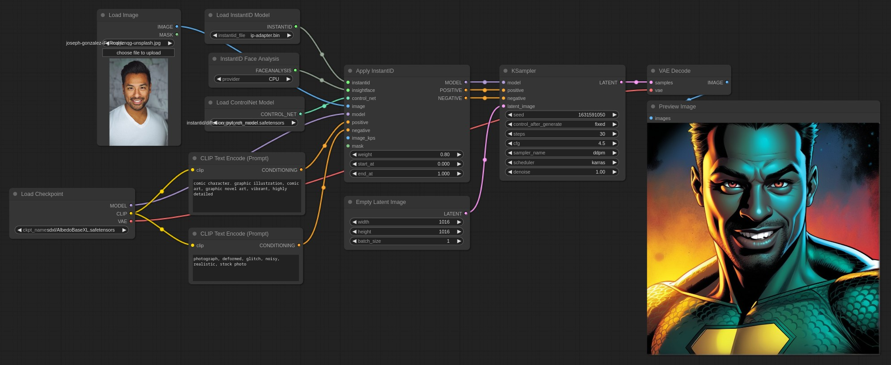

# ComfyUI InstantID (Native Support)

## Translations
- [简体中文 (Simplified Chinese)](./README.zh-CN.md)

Native [InstantID](https://github.com/InstantID/InstantID) support for [ComfyUI](https://github.com/comfyanonymous/ComfyUI).

This extension differs from the many already available as it doesn't use *diffusers* but instead implements InstantID natively and it fully integrates with ComfyUI.

> [!IMPORTANT]  
> **2025.04.14** - I do not use ComfyUI as my main way to interact with Gen AI anymore as a result I'm setting the repository in "maintenance only" mode. If there are crucial updates or PRs I might still consider merging them but I do not plan any consistent work on this repo.

## Basic Workflow

In the `examples` directory you'll find some basic workflows.



## Video Tutorial

<a href="https://youtu.be/wMLiGhogOPE" target="_blank">
 
</a>

** :movie_camera: [Introduction to InstantID features](https://youtu.be/wMLiGhogOPE)**

## Installation

**Upgrade ComfyUI to the latest version!**

Download or `git clone` this repository into the `ComfyUI/custom_nodes/` directory or use the Manager.

InstantID requires `insightface`, you need to add it to your libraries together with `onnxruntime` and `onnxruntime-gpu`.

The InsightFace model is **antelopev2** (not the classic buffalo_l). Download the models (for example from [here](https://drive.google.com/file/d/18wEUfMNohBJ4K3Ly5wpTejPfDzp-8fI8/view?usp=sharing) or [here](https://huggingface.co/MonsterMMORPG/tools/tree/main)), unzip and place them in the `ComfyUI/models/insightface/models/antelopev2` directory.

The **main model** can be downloaded from [HuggingFace](https://huggingface.co/InstantX/InstantID/resolve/main/ip-adapter.bin?download=true) and should be placed into the `ComfyUI/models/instantid` directory. (Note that the model is called *ip_adapter* as it is based on the [IPAdapter](https://github.com/tencent-ailab/IP-Adapter)).

You also needs a [controlnet](https://huggingface.co/InstantX/InstantID/resolve/main/ControlNetModel/diffusion_pytorch_model.safetensors?download=true), place it in the ComfyUI controlnet directory.

**Remember at the moment this is only for SDXL.**

## Troubleshooting

### **I. (For Windows Users) Unable to Build Insightface or Avoiding Visual Studio/VS C++ Build Tools**
If you're having trouble building `Insightface` or prefer not to install Visual Studio/VS C++ Build Tools, follow these steps:

1. **Check Your Python Version**:
   - If using ComfyUI Portable, navigate to the root folder.
   - Open CMD and run:  
     ```cmd
     python_embeded\python.exe -V
     ```  
2. **Download the Prebuilt Insightface Package**:
   - Based on your Python version, download the appropriate `.whl` file:  
     - [For Python 3.10](https://github.com/Gourieff/Assets/raw/main/Insightface/insightface-0.7.3-cp310-cp310-win_amd64.whl)  
     - [For Python 3.11](https://github.com/Gourieff/Assets/raw/main/Insightface/insightface-0.7.3-cp311-cp311-win_amd64.whl)  
     - [For Python 3.12](https://github.com/Gourieff/Assets/raw/main/Insightface/insightface-0.7.3-cp312-cp312-win_amd64.whl)  
   - Place the downloaded file into the ComfyUI root folder if using ComfyUI Portable.
3. **Run Command Prompt (CMD) from the Root Folder**:
   - For ComfyUI Portable, simply open CMD from the root folder.
4. **Update PIP**:
   - Run the following command:  
     ```cmd
     python_embeded\python.exe -m pip install -U pip
     ```  
5. **Install the Insightface Package**:
   - Use the command corresponding to your Python version:  
     - For Python 3.10:  
       ```cmd
       python_embeded\python.exe -m pip install insightface-0.7.3-cp310-cp310-win_amd64.whl
       ```  
     - For Python 3.11:  
       ```cmd
       python_embeded\python.exe -m pip install insightface-0.7.3-cp311-cp311-win_amd64.whl
       ```  
     - For Python 3.12:  
       ```cmd
       python_embeded\python.exe -m pip install insightface-0.7.3-cp312-cp312-win_amd64.whl
       ```
6. **Done**:  
   Enjoy using Insightface with your setup!

## Watermarks!

The training data is full of watermarks, to avoid them to show up in your generations use a resolution slightly different from 1024×1024 (or the standard ones) for example **1016×1016** works pretty well.

## Lower the CFG!

It's important to lower the CFG to at least 4/5 or you can use the `RescaleCFG` node.

## Face keypoints

The person is posed based on the keypoints generated from the reference image. You can use a different pose by sending an image to the `image_kps` input.


## Noise Injection

The default InstantID implementation seems to really burn the image, I find that by injecting noise to the negative embeds we can mitigate the effect and also increase the likeliness to the reference. The default Apply InstantID node automatically injects 35% noise, if you want to fine tune the effect you can use the Advanced InstantID node.

This is still experimental and may change in the future.

## Additional Controlnets

You can add more controlnets to the generation. An example workflow for depth controlnet is provided.

## Styling with IPAdapter

It's possible to style the composition with IPAdapter. An example is provided.


## Multi-ID

Multi-ID is supported but the workflow is a bit complicated and the generation slower. I'll check if I can find a better way of doing it. The "hackish" workflow is provided in the example directory.


## Advanced Node

There's an InstantID advanced node available, at the moment the only difference with the standard one is that you can set the weights for the instantID models and the controlnet separately. It now also includes a noise injection option. It might be helpful for finetuning.

The instantID model influences the composition of about 25%, the rest is the controlnet.

The noise helps reducing the "burn" effect.

## Other notes

It works very well with SDXL Turbo/Lighting. Best results with community's checkpoints.

- [RunComfy](https://www.runcomfy.com/) (ComfyUI Cloud)

### Esteemed individuals

- [Øystein Ø. Olsen](https://github.com/FireNeslo)
- [Jack Gane](https://github.com/ganeJackS)
- [Nathan Shipley](https://www.nathanshipley.com/)
- [Dkdnzia](https://github.com/Dkdnzia)

[And all my public and private sponsors!](https://github.com/sponsors/cubiq)
